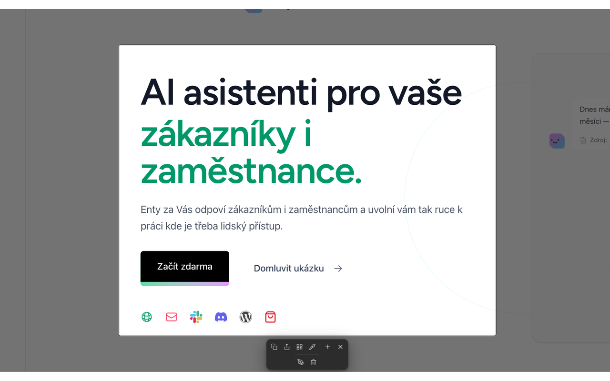

# Snipper

Chrome extension for fast website screenshots, color picker, annotations, and local history. Everything runs 100% in your browser — no cloud, no telemetry.



## Features

- **Crop snapshot** — hold <kbd>Shift</kbd> and drag to select an area. The screenshot is copied to clipboard and saved to history.
- **Full page snapshot** — via the popup button. Works with long scrolling pages.
- **Color picker** — select hex color from any pixel on the page.
- **Annotations** — draw and annotate directly on the screenshot.
- **History** — all screenshots are stored locally in IndexedDB, access them anytime.
- **QR code** — generate a QR code from the current page URL.

## Installation

### From Chrome Web Store

_(link will be added after publication)_

### Developer Installation

```bash
npm install
npm run build:prod
```

Then in Chrome:

1. `chrome://extensions/`
2. Enable **Developer mode**
3. **Load unpacked** → select the root of this repo

### Build Release ZIP

```bash
npm run package
```

Creates `release/snipper-{version}.zip` ready for uploading to Chrome Web Store. Contains only production files (no `.map`, no docs).

## Scripts

| Script | What it does |
|---|---|
| `npm run build` | Development build with sourcemaps |
| `npm run watch` | Auto-rebuild on changes |
| `npm run build:prod` | Production build (minify, drop console, no maps) |
| `npm run package` | Production build + compress to ZIP |
| `npm run typecheck` | TypeScript typecheck |

## Privacy

Snipper **stores and transmits no data outside your browser**. All screenshots and settings remain local. No analytics, no servers, no third-party sharing.

Full terms: **[Privacy Policy](https://profispojka.github.io/ChromeSniper/PRIVACY)**

## Permissions

Snipper requests only the bare minimum:

| Permission | Purpose |
|---|---|
| `activeTab` | Enable screenshots / color picker on the current tab after clicking the popup |
| `<all_urls>` host | Content script must run on any page you want to screenshot |
| `storage` | Local storage of user preferences (e.g., whether to strip tracking parameters from URLs when generating QR codes) |
| `clipboardWrite` | Copy PNG screenshot or hex color to clipboard |

Snipper **does not use** `tabs`, `cookies`, `history`, `webRequest`, or other sensitive permissions.

## License

[MIT](LICENSE)

Snipper bundles the [`qrcode-generator`](https://github.com/kazuhikoarase/qrcode-generator) library (MIT, © 2009 Kazuhiko Arase).

## Author

[Jirka Enty](https://entyai.cz) · [jirka@entyai.cz](mailto:jirka@entyai.cz)

---

## Chrome Web Store — Listing Draft

> This section is a helper for filling the [Web Store dashboard](https://chrome.google.com/webstore/devconsole). Can be deleted later.

### Short Description (up to 132 characters)

```
Fast website screenshots, color picker, annotations & history. Drag to crop, edit & save to clipboard and history.
```

### Detailed Description (~900 characters)

```
Snipper is a fast tool for taking screenshots directly in your browser. No cloud, no account, no telemetry — everything stays local.

What Snipper does:
• Drag to crop — hold Shift and drag to select an area. Screenshot is instantly in your clipboard.
• Full page screenshot — even on long scrolling pages.
• Color picker — select hex color from any pixel on the page.
• Annotations — draw and annotate directly on the screenshot.
• Local history — IndexedDB in your browser, nothing uploaded anywhere.
• QR code — generate a QR code from the current URL.

Privacy first:
Snipper collects and transmits no data. No analytics, no tracking. All functionality runs 100% offline in your browser.

Open source under MIT license.
```

### Single Purpose

```
Capture and annotate website screenshots with local history.
```

### Permission Justifications (for dashboard)

- **`activeTab`**: Snipper needs access to the current tab to inject the content script and take a screenshot after clicking the popup or Shift+dragging. Only activates after user gesture.
- **`<all_urls>` host permission**: Content script must inject on any page the user wants to screenshot. Permission is not used to read page content for any other purpose.
- **`storage`**: Local storage of minor user preferences (e.g., whether to strip tracking parameters from URLs when generating QR codes).
- **`clipboardWrite`**: Copy the captured PNG screenshot or hex color value to the system clipboard.

### Data Usage (Privacy Practices Form)

- ✅ **Does not collect or transmit user data**
- ✅ **Does not sell user data to third parties**
- ✅ **Does not use user data for purposes unrelated to the item's single purpose**

### Remote Code Justification

Snipper **does not use, execute, or load any remote code**. All code is bundled and minified at build time. No dynamic imports, no script tags, no external CDNs. The only external resource is the qrcode-generator library, which is bundled locally and included in the release ZIP.

### Category

- Primary: **Productivity**
- Secondary: **Tools** (optional)

### Developer Program Policies Confirmation

✅ Snipper complies with all Chrome Web Store Developer Program Policies:
- Does not collect or transmit personal data
- Does not use misleading or deceptive practices
- Does not inject ads or modify page content
- Has a clear single purpose (screenshot tool)
- Respects user privacy and provides transparent permissions
- Includes proper documentation and privacy policy
- Does not distribute malware or harmful content
